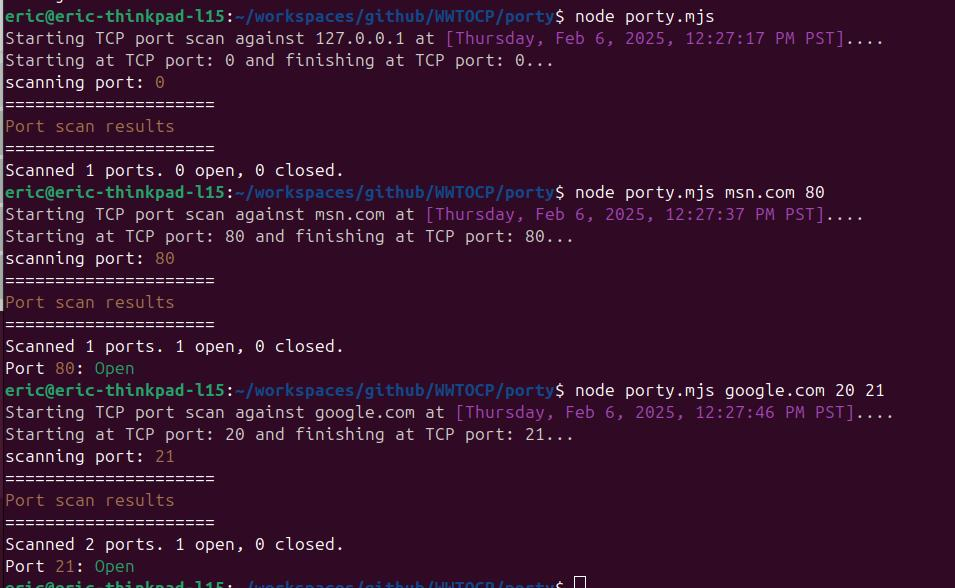

# 🚀 Porty - A Network Port Scanner

**Porty** is a simple Node.js program to scan network protocol ports.

---

## 📥 Installation

Clone the repository and run the script:

```sh
git clone <your-repo-url>
cd porty
node porty.mjs
```

## 🛠️ Advanced features
```sh
node porty.mjs msn.com 80
node porty.mjs google.com 20 21
```

## Example Output

